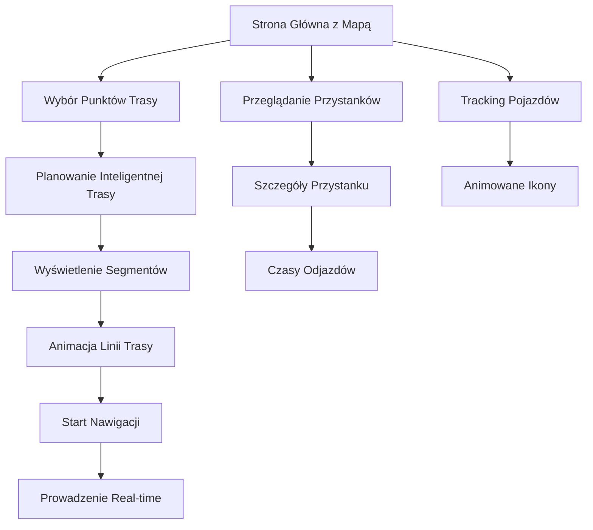

# Urban Navigator - Rozszerzone Funkcjonalności
## Dokument Wymagań Produktowych (PRD)

## 1. Przegląd Produktu

Urban Navigator to zaawansowana aplikacja nawigacyjna dla komunikacji publicznej w Krakowie, która zostanie rozszerzona o funkcjonalności real-time tracking pojazdów, inteligentne planowanie tras z segmentami pieszymi oraz animowane wizualizacje tras. Aplikacja ma na celu zapewnienie użytkownikom najbardziej aktualnych informacji o transporcie publicznym z intuicyjnym interfejsem i płynnymi animacjami.

Główne cele rozszerzenia:
- Zwiększenie dokładności planowania podróży poprzez real-time tracking
- Poprawa user experience dzięki animowanym wizualizacjom
- Optymalizacja tras z uwzględnieniem tras pieszych do przystanków

## 2. Kluczowe Funkcjonalności

### 2.1 Role Użytkowników
Aplikacja nie wymaga rozróżnienia ról - wszyscy użytkownicy mają dostęp do pełnej funkcjonalności.

### 2.2 Moduły Funkcjonalne

Rozszerzona aplikacja Urban Navigator składa się z następujących głównych stron:

1. **Strona główna z mapą**: mapa interaktywna, real-time tracking pojazdów, planowanie tras, animowane linie tras
2. **Panel planowania trasy**: wyszukiwanie lokalizacji, wybór środka transportu, wyświetlanie segmentów tras
3. **Panel informacji o przystankach**: szczegóły przystanków, linie, czasy odjazdów, typy przystanków
4. **Panel nawigacji aktywnej**: prowadzenie w czasie rzeczywistym, postęp trasy, live chat

### 2.3 Szczegóły Stron

| Nazwa Strony | Nazwa Modułu | Opis Funkcjonalności |
|--------------|--------------|---------------------|
| Strona główna | Mapa interaktywna | Wyświetla mapę Krakowa z przystankami tramwajowymi, autobusowymi i mieszanymi. Różne ikony dla różnych typów przystanków. |
| Strona główna | Real-time tracking pojazdów | Pokazuje aktualne pozycje tramwajów i autobusów na mapie z numerami linii. Animowane ikony poruszające się po trasach. |
| Strona główna | Animowane linie tras | Rysuje trasy z płynnymi animacjami. Różne style dla segmentów pieszych (przerywana linia), tramwajowych (zielona) i autobusowych (pomarańczowa). |
| Panel planowania | Wyszukiwanie lokalizacji | Umożliwia wyszukiwanie punktów startowych i docelowych z podpowiedziami. |
| Panel planowania | Inteligentne planowanie tras | Oblicza optymalne trasy z uwzględnieniem tras pieszych do przystanków. Wyświetla czas i dystans marszu (np. "5 min pieszo do przystanku"). |
| Panel planowania | Segmenty tras | Pokazuje szczegółowy podział trasy na etapy: pieszo → przystanek → transport → przystanek → pieszo. |
| Panel informacji | Szczegóły przystanków | Wyświetla nazwę przystanku, typ (tramwajowy/autobusowy/mieszany), wszystkie linie przechodzące przez przystanek. |
| Panel informacji | Czasy odjazdów real-time | Pokazuje aktualne czasy odjazdów dla każdej linii z uwzględnieniem opóźnień. |
| Panel informacji | Filtrowanie przystanków | Umożliwia filtrowanie widocznych przystanków według typu transportu (tramwaje/autobusy/wszystkie). |
| Panel nawigacji | Prowadzenie real-time | Pokazuje aktualną pozycję użytkownika na trasie z postępem w procentach. |
| Panel nawigacji | Powiadomienia o przesiadkach | Informuje o zbliżających się przesiadkach i konieczności przejścia pieszo. |

## 3. Główne Procesy

### Proces Planowania Trasy z Segmentami Pieszymi:
1. Użytkownik wprowadza punkt startowy i docelowy
2. System znajduje najbliższe przystanki w promieniu 500m od punktów
3. Oblicza trasy piesze do/z przystanków z czasem marszu
4. Planuje optymalną trasę transportem publicznym między przystankami
5. Wyświetla kompletną trasę z animowanymi segmentami
6. Pokazuje szczegółowe informacje o każdym etapie

### Proces Real-time Tracking:
1. System pobiera aktualne pozycje pojazdów z API GTFS-RT
2. Wyświetla pojazdy na mapie z numerami linii
3. Animuje ruch pojazdów po trasach
4. Aktualizuje pozycje co 30 sekund
5. Pokazuje opóźnienia i zakłócenia



## 4. Projekt Interfejsu Użytkownika

### 4.1 Styl Designu
- **Kolory główne**: Niebieski (#3B82F6) dla tramwajów, Pomarańczowy (#F97316) dla autobusów
- **Kolory dodatkowe**: Szary (#6B7280) dla tras pieszych, Zielony (#10B981) dla przystanków mieszanych
- **Styl przycisków**: Zaokrąglone z efektami hover i animacjami
- **Czcionka**: Inter, rozmiary 12px-24px
- **Layout**: Glassmorphism z backdrop-blur, karty z cieniami
- **Ikony**: Lucide icons z animacjami micro-interactions
- **Animacje**: Smooth transitions 300ms, bounce effects dla interakcji

### 4.2 Przegląd Designu Stron

| Nazwa Strony | Nazwa Modułu | Elementy UI |
|--------------|--------------|-------------|
| Strona główna | Mapa interaktywna | Leaflet map z custom markerami. Ikony przystanków: 🚊 (tramwaj - niebieski), 🚌 (autobus - pomarańczowy), 🚏 (mieszany - zielony). Animowane pojazdy z numerami linii. |
| Strona główna | Animowane linie | Gradient lines z animacją rysowania. Przerywana linia dla tras pieszych, ciągła dla transportu. Progress indicator na linii. |
| Panel planowania | Segmenty tras | Karty z ikonami dla każdego segmentu. Timeline view z czasami i dystansami. Color coding według typu transportu. |
| Panel informacji | Szczegóły przystanków | Modal/sidebar z nazwą, typem, listą linii w kolorowych badge'ach. Real-time departure times z countdown. |
| Panel nawigacji | Prowadzenie | Progress bar z aktualną pozycją. Karty z instrukcjami nawigacji. Powiadomienia push o przesiadkach. |

### 4.3 Responsywność
Aplikacja jest mobile-first z adaptacją na desktop. Optymalizacja touch interactions dla urządzeń mobilnych. Responsive breakpoints: 768px (tablet), 1024px (desktop).

## 5. Wymagania Techniczne

### 5.1 Nowe Struktury Danych
```typescript
interface EnhancedGTFSStop extends GTFSStop {
  walkingTime?: number; 
  walkingDistance?: number; 
  realTimeDepartures?: RealTimeDeparture[];
}

interface RealTimeDeparture {
  lineNumber: string;
  destination: string;
  departureTime: string;
  delay: number; 
  vehicleId?: string;
}

interface VehiclePosition {
  vehicleId: string;
  lineNumber: string;
  lat: number;
  lng: number;
  bearing: number;
  speed: number;
  timestamp: Date;
}

interface RouteSegment {
  type: 'walking' | 'bus' | 'tram';
  startPoint: LatLng;
  endPoint: LatLng;
  duration: number;
  distance: number;
  instructions: string;
  lineNumber?: string;
  stopSequence?: GTFSStop[];
}
```

### 5.2 Nowe API Endpoints
- `GET /api/vehicles/positions` - aktualne pozycje pojazdów
- `GET /api/stops/{stopId}/departures` - real-time odjazdy
- `GET /api/routes/multimodal` - planowanie tras z segmentami pieszymi
- `WebSocket /ws/vehicle-tracking` - real-time updates pozycji

### 5.3 Animacje i Efekty
- Animowane rysowanie linii trasy z użyciem CSS animations
- Smooth movement pojazdów z interpolacją pozycji
- Fade in/out effects dla UI elementów
- Loading skeletons dla asynchronicznych danych
- Micro-interactions dla przycisków i hover states