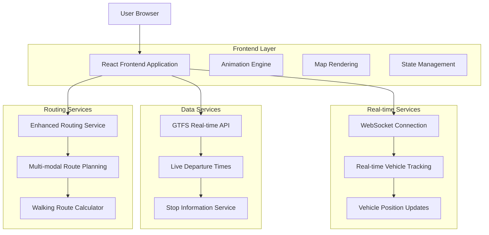
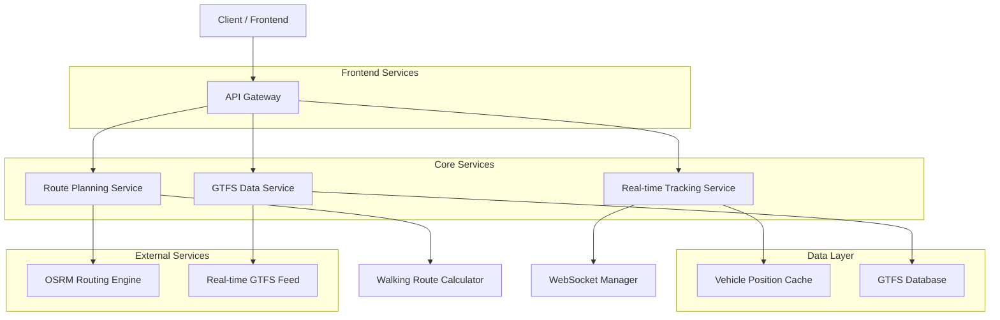
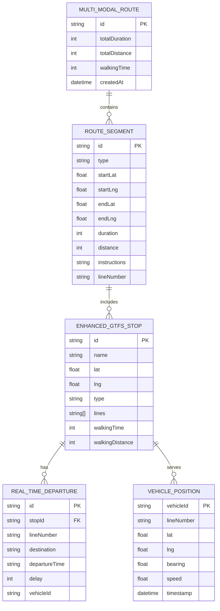

# Urban Navigator - Rozszerzona Architektura Techniczna
## Dokument Architektury Technicznej

## 1. Projekt Architektury



## 2. Opis Technologii

- **Frontend**: React@18 + TypeScript + Tailwind CSS + Vite
- **Mapa**: Leaflet + React-Leaflet
- **Animacje**: Framer Motion + CSS Animations
- **Real-time**: WebSocket API + Server-Sent Events
- **Routing**: OSRM + Enhanced GTFS Processing
- **State Management**: React Context + useReducer
- **Data Fetching**: React Query + Axios

## 3. Definicje Tras

| Trasa | Cel |
|-------|-----|
| / | Strona główna z mapą i wszystkimi funkcjonalnościami |
| /route/:routeId | Szczegóły konkretnej trasy z real-time tracking |
| /stop/:stopId | Szczegółowe informacje o przystanku |
| /navigation/:sessionId | Aktywna nawigacja z prowadzeniem real-time |

## 4. Definicje API

### 4.1 Core API

**Real-time Vehicle Positions**
```
GET /api/vehicles/positions
```

Request:
| Nazwa Parametru | Typ | Wymagany | Opis |
|-----------------|-----|----------|------|
| bounds | string | false | Granice mapy w formacie "lat1,lng1,lat2,lng2" |
| lines | string[] | false | Numery linii do filtrowania |

Response:
| Nazwa Parametru | Typ | Opis |
|-----------------|-----|------|
| vehicles | VehiclePosition[] | Lista pozycji pojazdów |
| timestamp | string | Czas ostatniej aktualizacji |

Example:
```json
{
  "vehicles": [
    {
      "vehicleId": "tram_001",
      "lineNumber": "3",
      "lat": 50.0677,
      "lng": 19.9449,
      "bearing": 45,
      "speed": 25,
      "timestamp": "2024-01-15T10:30:00Z"
    }
  ],
  "timestamp": "2024-01-15T10:30:00Z"
}
```

**Enhanced Route Planning**
```
POST /api/routes/multimodal
```

Request:
| Nazwa Parametru | Typ | Wymagany | Opis |
|-----------------|-----|----------|------|
| start | LatLng | true | Punkt startowy |
| end | LatLng | true | Punkt docelowy |
| transportModes | string[] | true | Dozwolone środki transportu |
| maxWalkingDistance | number | false | Maksymalny dystans pieszo (metry) |
| departureTime | string | false | Planowany czas wyjazdu |

Response:
| Nazwa Parametru | Typ | Opis |
|-----------------|-----|------|
| segments | RouteSegment[] | Segmenty trasy |
| totalDuration | number | Całkowity czas podróży |
| totalDistance | number | Całkowity dystans |
| walkingTime | number | Czas marszu pieszo |

**Real-time Stop Departures**
```
GET /api/stops/{stopId}/departures
```

Response:
| Nazwa Parametru | Typ | Opis |
|-----------------|-----|------|
| stopInfo | EnhancedGTFSStop | Informacje o przystanku |
| departures | RealTimeDeparture[] | Najbliższe odjazdy |

**WebSocket Vehicle Tracking**
```
WebSocket /ws/vehicle-tracking
```

Messages:
- `subscribe`: Subskrypcja aktualizacji dla określonych linii
- `vehicle_update`: Aktualizacja pozycji pojazdu
- `departure_update`: Aktualizacja czasów odjazdów

## 5. Architektura Serwera



## 6. Model Danych

### 6.1 Definicja Modelu Danych



### 6.2 Data Definition Language

**Enhanced GTFS Stops Table**
```sql
-- Rozszerzona tabela przystanków
CREATE TABLE enhanced_gtfs_stops (
    id VARCHAR(50) PRIMARY KEY,
    name VARCHAR(255) NOT NULL,
    lat DECIMAL(10, 8) NOT NULL,
    lng DECIMAL(11, 8) NOT NULL,
    type VARCHAR(20) CHECK (type IN ('bus', 'tram', 'both')) NOT NULL,
    lines TEXT[] NOT NULL,
    zone VARCHAR(10),
    walking_time INTEGER DEFAULT NULL,
    walking_distance INTEGER DEFAULT NULL,
    created_at TIMESTAMP WITH TIME ZONE DEFAULT NOW(),
    updated_at TIMESTAMP WITH TIME ZONE DEFAULT NOW()
);

-- Indeksy dla wydajności
CREATE INDEX idx_enhanced_stops_location ON enhanced_gtfs_stops USING GIST (
    ll_to_earth(lat, lng)
);
CREATE INDEX idx_enhanced_stops_type ON enhanced_gtfs_stops(type);
CREATE INDEX idx_enhanced_stops_lines ON enhanced_gtfs_stops USING GIN(lines);
```

**Real-time Departures Table**
```sql
-- Tabela odjazdów w czasie rzeczywistym
CREATE TABLE real_time_departures (
    id UUID PRIMARY KEY DEFAULT gen_random_uuid(),
    stop_id VARCHAR(50) REFERENCES enhanced_gtfs_stops(id),
    line_number VARCHAR(10) NOT NULL,
    destination VARCHAR(255) NOT NULL,
    departure_time TIME NOT NULL,
    delay INTEGER DEFAULT 0,
    vehicle_id VARCHAR(50),
    created_at TIMESTAMP WITH TIME ZONE DEFAULT NOW(),
    expires_at TIMESTAMP WITH TIME ZONE NOT NULL
);

-- Indeksy
CREATE INDEX idx_departures_stop_id ON real_time_departures(stop_id);
CREATE INDEX idx_departures_line ON real_time_departures(line_number);
CREATE INDEX idx_departures_time ON real_time_departures(departure_time);
CREATE INDEX idx_departures_expires ON real_time_departures(expires_at);
```

**Vehicle Positions Table**
```sql
-- Tabela pozycji pojazdów
CREATE TABLE vehicle_positions (
    vehicle_id VARCHAR(50) PRIMARY KEY,
    line_number VARCHAR(10) NOT NULL,
    lat DECIMAL(10, 8) NOT NULL,
    lng DECIMAL(11, 8) NOT NULL,
    bearing DECIMAL(5, 2),
    speed DECIMAL(5, 2),
    timestamp TIMESTAMP WITH TIME ZONE NOT NULL,
    created_at TIMESTAMP WITH TIME ZONE DEFAULT NOW()
);

-- Indeksy
CREATE INDEX idx_vehicle_positions_line ON vehicle_positions(line_number);
CREATE INDEX idx_vehicle_positions_location ON vehicle_positions USING GIST (
    ll_to_earth(lat, lng)
);
CREATE INDEX idx_vehicle_positions_timestamp ON vehicle_positions(timestamp);
```

**Route Segments Table**
```sql
-- Tabela segmentów tras
CREATE TABLE route_segments (
    id UUID PRIMARY KEY DEFAULT gen_random_uuid(),
    route_id UUID NOT NULL,
    segment_order INTEGER NOT NULL,
    type VARCHAR(20) CHECK (type IN ('walking', 'bus', 'tram')) NOT NULL,
    start_lat DECIMAL(10, 8) NOT NULL,
    start_lng DECIMAL(11, 8) NOT NULL,
    end_lat DECIMAL(10, 8) NOT NULL,
    end_lng DECIMAL(11, 8) NOT NULL,
    duration INTEGER NOT NULL,
    distance INTEGER NOT NULL,
    instructions TEXT,
    line_number VARCHAR(10),
    geometry JSONB,
    created_at TIMESTAMP WITH TIME ZONE DEFAULT NOW()
);

-- Indeksy
CREATE INDEX idx_route_segments_route_id ON route_segments(route_id);
CREATE INDEX idx_route_segments_order ON route_segments(route_id, segment_order);
CREATE INDEX idx_route_segments_type ON route_segments(type);
```

**Dane inicjalne**
```sql
-- Przykładowe dane przystanków
INSERT INTO enhanced_gtfs_stops (id, name, lat, lng, type, lines, zone) VALUES
('1001', 'Dworzec Główny', 50.0677, 19.9449, 'both', ARRAY['1','3','6','8','13','24','52','124','152','208'], 'A'),
('1002', 'Teatr Bagatela', 50.0625, 19.9375, 'both', ARRAY['1','6','8','18','124','152'], 'A'),
('1003', 'Plac Wszystkich Świętych', 50.0614, 19.9356, 'both', ARRAY['1','6','8','18','124','152','184'], 'A'),
('1004', 'Wawel', 50.0544, 19.9356, 'bus', ARRAY['124','152','184'], 'A'),
('1005', 'Poczta Główna', 50.0641, 19.9370, 'tram', ARRAY['1','3','6','8','13'], 'A');

-- Przykładowe pozycje pojazdów
INSERT INTO vehicle_positions (vehicle_id, line_number, lat, lng, bearing, speed, timestamp) VALUES
('tram_001', '3', 50.0677, 19.9449, 45.0, 25.5, NOW()),
('bus_124_01', '124', 50.0625, 19.9375, 180.0, 30.0, NOW()),
('tram_002', '1', 50.0641, 19.9370, 90.0, 20.0, NOW());
```